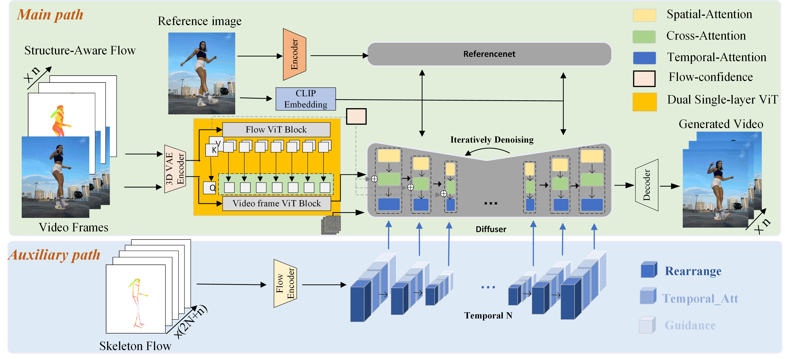

<p align="center">
  <h1 align="center">CoMotion</h1>
  <h2 align="center">Flow-Driven Dual-Path Diffusion Models for Consistent Human Motion Transfer</h2>
</p>

<p align="center">
  <a href="[Paper URL]">
    
  </a>
  <a href="[Code URL]">
    
  </a>
</p>

---

## Authors

<div align="center">

| Author | Affiliation |
|--------|-------------|
| [Xiangyang Wang](mailto:wangxiangyang@shu.edu.cn) | School of Communication and Information Engineering, Shanghai University |
| [Yuqing Cai](mailto:3235721579@shu.edu.cn) | School of Communication and Information Engineering, Shanghai University |
| [Rui Wang](mailto:rwang@shu.edu.cn) ✉ | School of Communication and Information Engineering, Shanghai University |
| [Erkang Cheng](mailto:chengerkang@nullmax.ai) | Nullmax (Shanghai) Co., Ltd., Shanghai, China |

</div>

---

## Abstract

Despite impressive advancements in human motion transfer based on diffusion models, existing methods still struggle to generate temporally consistent and realistic human motion, often exhibiting motion discontinuities, appearance (or identity)-motion conflicts, and visual artifacts such as phantom limbs. These issues largely stem from inaccurate 2D pose or 3D SMPL mesh estimation and the lack of explicit motion modeling to capture coherent temporal dependencies across frames.

To address these challenges, we introduce **CoMotion**, flow-driven dual-path diffusion models designed for **C**onsistent human **Motion** transfer. Specifically, it consists of three units:

1. **Dual-Path Motion Coordination** integrates global motion priors from an auxiliary temporal branch into the main path. The main path captures fine-grained local motion via interleaved video-flow embeddings, while the auxiliary path encodes long-range temporal dependencies through external temporal blocks, ensuring globally coherent motion.

2. **Structure-Aware Flow** mechanism embeds 3D structural priors into 2D optical flow, guided by surface normal and Euler continuity constraints, enabling geometrically consistent and perceptually stable motion synthesis with respect to underlying 3D geometry.

3. **Dual single-layer ViT module** mitigates motion-appearance discrepancies.

Extensive experiments demonstrate that CoMotion significantly improves the continuity of local body motion and global human motion as well as the generation quality, achieving competitive performance on benchmark datasets.

---

## Method Overview

<p align="center">
  
</p>

> **Figure:** Overview of the proposed CoMotion framework, which consists of three key components: (1) Dual-Path Motion Coordination, (2) Structure-Aware Flow mechanism, and (3) Dual single-layer ViT module.

---

## Video Demo

https://github.com/user/CoMotion/blob/main/fig/video/MyVideo_3.mp4

---

## Citation

If you find this work helpful for your research, please consider citing:

```bibtex
@article{wang2025comotion,
  title={CoMotion: Flow-Driven Dual-Path Diffusion Models for Consistent Human Motion Transfer},
  author={Wang, Xiangyang and Cai, Yuqing and Wang, Rui and Cheng, Erkang},
  journal={arXiv preprint arXiv:XXXX.XXXXX},
  year={2025}
}
```

---

## Contact

For questions or discussions, please feel free to reach out:
- ✉️ Corresponding Author: [Rui Wang](mailto:rwang@shu.edu.cn)
- 📧 [Xiangyang Wang](mailto:wangxiangyang@shu.edu.cn)
- 📧 [Yuqing Cai](mailto:3235721579@shu.edu.cn)
- 📧 [Erkang Cheng](mailto:chengerkang@nullmax.ai)
